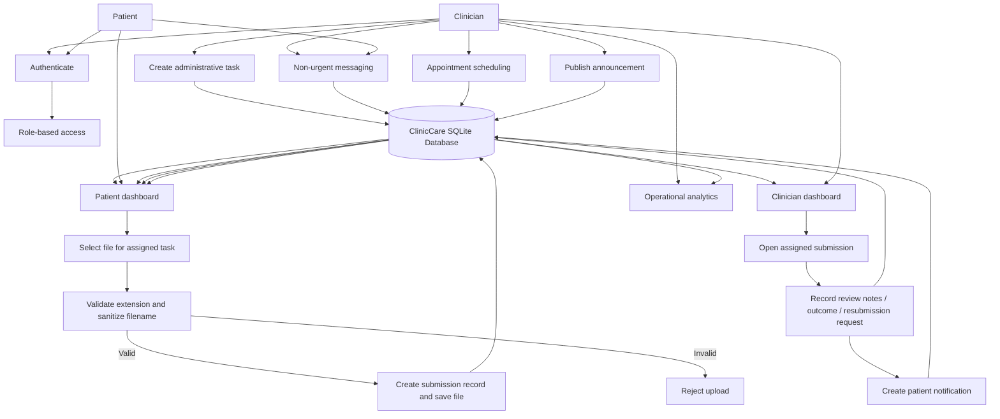

# ClinicCare-Lite Data-Flow Diagram

This diagram shows the main administrative task/submission/review flow and the supporting communication features.

## Data-Handling Notes

- Role and ownership checks protect patient-specific tasks and submissions.
- Upload validation restricts file extensions and sanitizes filenames before storage.
- Review outcomes and notifications remain administrative; the application does not generate diagnoses or treatment recommendations.
- Messaging is intended for non-urgent communication and not emergencies.
