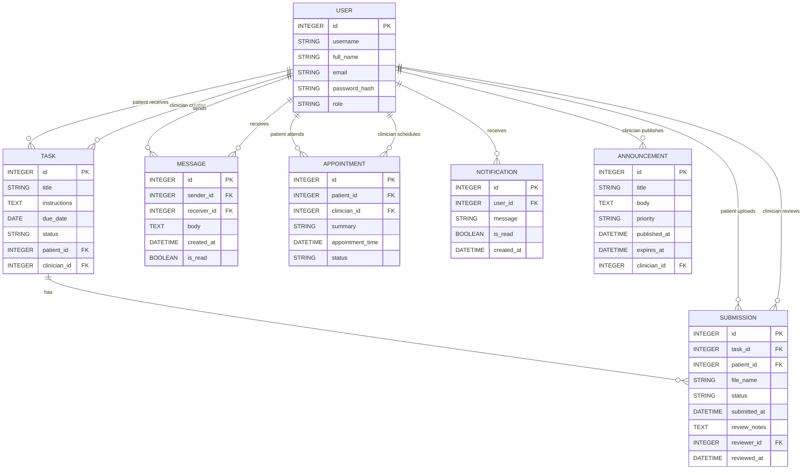

# ClinicCare-Lite ER / Class Diagram

This diagram represents the main persistent models in the completed ClinicCare-Lite application and the principal relationships between users, tasks, submissions, communication, appointments, notifications and announcements.

## Model Responsibilities

- **User** stores account identity, role and password hash information.
- **Task** links a clinician and patient to an administrative request with instructions, due date and status.
- **Submission** records the patient's uploaded file and the clinician's review status/notes.
- **Message** supports basic non-urgent clinician/patient communication.
- **Appointment** stores scheduling information between a patient and clinician.
- **Notification** stores user-facing application alerts.
- **Announcement** stores clinic-wide administrative notices created by clinicians.
