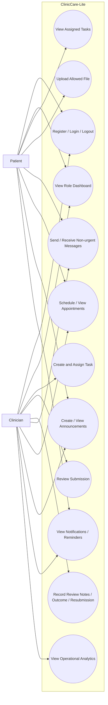
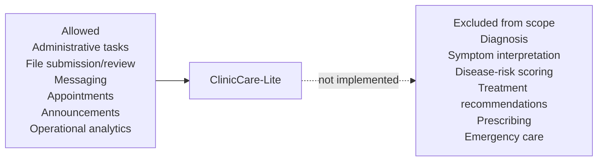

# ClinicCare-Lite Use-Case Diagram

ClinicCare-Lite supports administrative and communication workflows for two roles: Clinician and Patient. The application is intentionally non-diagnostic.

## Scope Boundary

