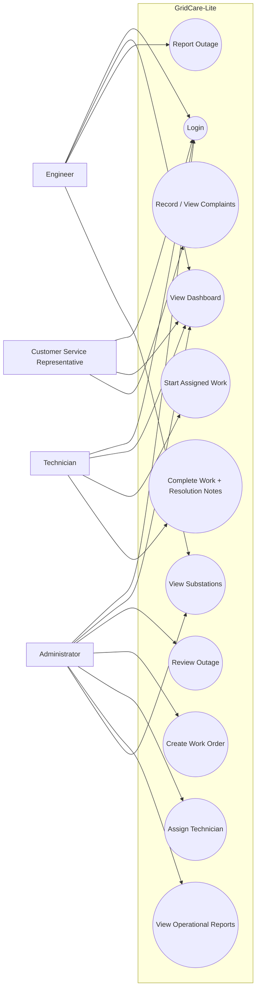
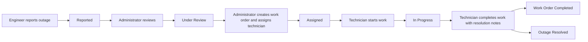

# GridCare-Lite Use-Case Diagram

This diagram summarizes the main role-based actions implemented in GridCare-Lite.

```mermaid
flowchart LR
    ADMIN[Administrator]
    ENGINEER[Engineer]
    TECH[Technician]
    CSR[Customer Service Representative]

    subgraph APP[GridCare-Lite]
        LOGIN((Login))
        DASH((View Dashboard))
        REPORT((Report Outage))
        REVIEW((Review Outage))
        CREATEWO((Create Work Order))
        ASSIGN((Assign Technician))
        START((Start Assigned Work))
        COMPLETE((Complete Work + Resolution Notes))
        COMPLAINT((Record / View Complaints))
        SUBSTATION((View Substations))
        REPORTS((View Operational Reports))
    end

    ADMIN --> LOGIN
    ENGINEER --> LOGIN
    TECH --> LOGIN
    CSR --> LOGIN

    ADMIN --> DASH
    ENGINEER --> DASH
    TECH --> DASH
    CSR --> DASH

    ENGINEER --> REPORT
    ENGINEER --> SUBSTATION

    ADMIN --> REVIEW
    ADMIN --> CREATEWO
    ADMIN --> ASSIGN
    ADMIN --> REPORTS
    ADMIN --> SUBSTATION

    TECH --> START
    TECH --> COMPLETE

    CSR --> COMPLAINT
```

## Core Workflow

```mermaid
flowchart LR
    A[Engineer reports outage] --> B[Reported]
    B --> C[Administrator reviews]
    C --> D[Under Review]
    D --> E[Administrator creates work order and assigns technician]
    E --> F[Assigned]
    F --> G[Technician starts work]
    G --> H[In Progress]
    H --> I[Technician completes work with resolution notes]
    I --> J[Work Order Completed]
    I --> K[Outage Resolved]
```
