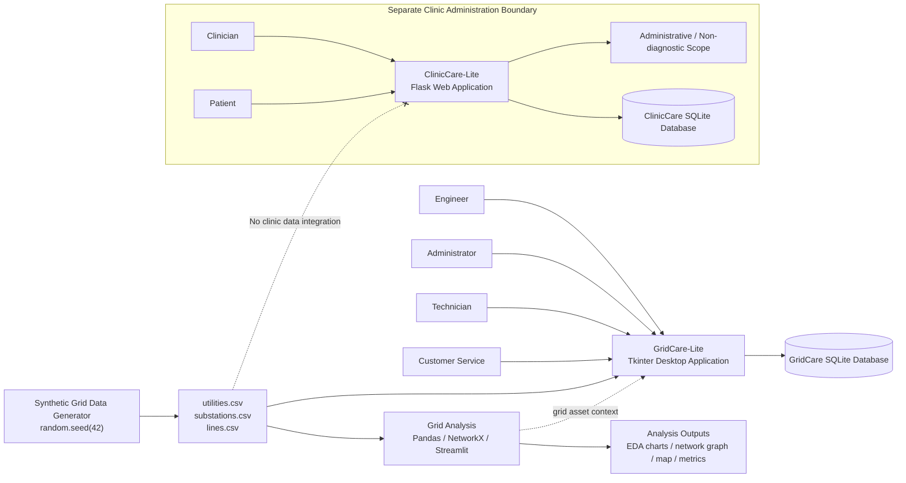

# Overall Project Architecture

This diagram shows the high-level relationship between the three CS 112 project components. Grid Analysis and GridCare-Lite share the synthetic electricity-grid data domain. ClinicCare-Lite is intentionally separated because it has a different administrative purpose and privacy boundary.

## Architectural Notes

- The synthetic grid generator is the source of the three electricity-grid CSV datasets.
- Grid Analysis performs validation, exploratory analysis, network analysis, reliability analysis and visualisation.
- GridCare-Lite uses grid asset information for outage and work-order management and stores application records in SQLite.
- ClinicCare-Lite uses Flask/SQLAlchemy with its own SQLite database for administrative clinic workflows.
- ClinicCare-Lite does not consume grid data and does not implement diagnosis, symptom interpretation, disease-risk scoring, prescribing or treatment recommendations.
